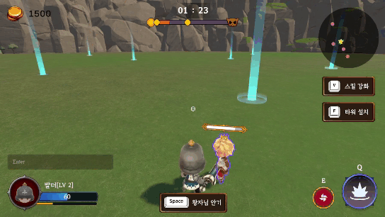
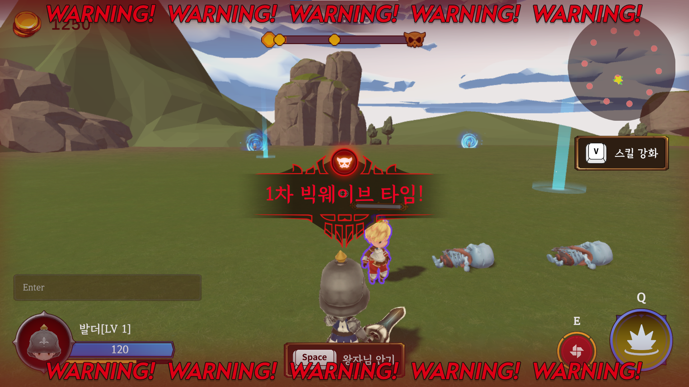

# 킹덤 (King Dumb)

## Ⅰ. 프로젝트 소개

### 개요

- 최대 4인의 플레이어가 타워 설치 및 스킬 트리 강화를 통해 몬스터를 처치하고 왕자를 지키는 3D 디펜스 전략 게임 서비스

### 기간 및 인원

- 2024.10.14 ~ 2024.11.19 (약 5주)
- 6인 (클라이언트 3인, 서버 3인)

### 게임 스토리

### 집 나간 철부지 왕자를 되찾아오기 위한 기사들의 여정이 시작된다!

```bash
와! 샌즈!(언더테일)를 보고 그의 강함에 깊은 감명을 받은 중2병(또는 괴짜) 왕자. 스켈레톤의 왕이 되어 샌즈 같은 병기들을 만들면 왕국의 안보가 더 좋아질 것이라고 생각한다.

마침 왕이 들어와 왕자가 게임하는 모습을 보고 잔소리를 시작한다. 왕자는 나름 왕국을 위한 생각을 하는 중이었는데 잔소리를 들으니 화가 났다. 감정을 주체하지 못한 왕자는 정말로 스켈레톤의 왕이 되기 위해 왕국 밖으로 몰래 나가게 된다. (나갈 때 본인의 안전을 위해 보호막 장치도 들고 나간다.)

비교적 짧은 시간이 흐른 후

나름 고민이 많아보이는 왕자를 괜히 혼냈나 싶어 사과하러 간 왕은 왕자가 없어진 것을 보고 왕자의 행방을 수소문하다가 왕국을 나갔다는 것을 알게 되었다.

왕국 밖은 최근 알 수 없는 이유로 스켈레톤이 점점 늘어나서 위험한 상태였다. 왕은 어서 왕자를 데려오라고 기사들에게 급히 명한다.
```

<br>

## Ⅱ. 게임 소개

### [킹덤 소개 영상](https://youtu.be/_EfpD6Zsho4?si=WGw64jChRMs3ZB3H)

### 01. 게임 화면

#### 시작 화면


<br/>
- Start 버튼 클릭 시 로그인 화면으로 넘어감

<br/>

#### 로그인 화면


<br/>
- 닉네임을 입력하여 비회원으로 게임 로비 입장

<br/>

#### 로비 화면


<br/>
- 방 목록 : 방을 클릭하면 방에 입장<br/>
- 방 생성 : 방 제목과 비공개 여부를 클릭할수있음<br/>
    - 비공개 체크시 : 방목록에 잠금이미지와 함께 표시되며 방코드를 입력 해야 입장 가능<br/>
- 방 찾기 : 방 코드를 입력하여 입장 가능<br/>
- 빠른 입장 : 방 목록에 공개되어 있는 임의의 방에 입장함<br/>

<br/>

#### 대기방 화면


<br/>
- 방 인원들은 Ready 버튼으로 게임 준비
- 방장은 인원들이 모두 Ready 시 F5 입력으로 게임 시작 가능
- 플레이할 캐릭터를 고르고 체험해볼 수 있음

<br/>

### 02. 플레이어 기본 조작 🏃‍♀️


<br/>

#### 플레이어 이동

WASD 또는 방향키를 통해 상하좌우로 이동 가능
<br/>

#### 달리기

Shift 입력을 통해 달리기 가능
<br/>

#### 공격

마우스 왼쪽 버튼을 통해 일반 공격 가능

E 입력을 통해 스킬 공격 가능

Q 입력을 통해 궁극기 공격 가능
<br/>

### 03. 인게임 요소

#### 스킬 강화


<br/>
몬스터 처치 시 얻는 경험치를 통해 레벨 업 후 V 입력을 통해 스킬 강화 UI 접근 가능

각 직업군 별 고유한 스킬 강화, 최대 10개의 강화 가능
<br/>

#### 타워


<br/>
몬스터 처치 시 얻는 골드를 통해 타워 설치 가능

타워 부지에 일정 거리 이내로 접근 시 F 입력을 통해 타워 설치 UI 접근 가능
<br/>

#### 몬스터


<br/>
일반, 전사, 마법사, 도적, 플라잉 몬스터

<br/>

#### 왕자


<br/>
일정 시간이 지나면 랜덤한 위치를 향해 랜덤한 속도로 이동

플레이어가 가까이 다가간 후 Space bar 입력을 통해 왕자님 안기 가능

#### 스테이지 이동


<br/>
총 3개의 스테이지, 마지막 스테이지에서 보스 몬스터 출현

#### 빅 웨이브


<br/>

## Ⅲ. 기술 스택

### Server

- Photon PUN2
- Photon CHAT

### Client

- Unity

### Tools

- GitLab
- Notion
- Jira
- Figma
- MatterMost

<br/>

## Ⅳ. 팀원 소개 및 회고

<table>
  <tr>
      <td align="center">
        <a href="https://github.com/HyunV">
          
        </a>
      </td>
      <td align="center">
        <a href="https://github.com/05Ri">
          
        </a>
      </td>
      <td align="center">
        <a href="https://github.com/Jinhyeon-Kim-6619">
          
        </a>
      </td>
      <td align="center">
        <a href="https://github.com/SeongYunOH">
          
        </a>
      </td>
      <td align="center">
        <a href="https://github.com/Basaeng">
          
        </a>
      </td>
      <td align="center">
        <a href="https://github.com/Jinhyunji">
          
        </a>
      </td>
  </tr>
  <tr>
    <td align="center">
      <a href="https://github.com/HyunV">
        현준호
      </a>
    </td>
    <td align="center">
      <a href="https://github.com/05Ri">
        김예현
      </a>
    </td>
    <td align="center">
      <a href="https://github.com/Jinhyeon-Kim-6619">
        김진현
      </a>
    </td>
    <td align="center">
      <a href="https://github.com/SeongYunOH">
        오성윤
      </a>
    </td>
    <td align="center">
      <a href="https://github.com/Basaeng">
        이종민
      </a>
    </td>
    <td align="center">
      <a href="https://github.com/Jinhyunji">
        진현지
      </a>
    </td>
  </tr>
  <tr>
    <td align="center">
        팀장, 서버
    </td>
    <td align="center">
      클라이언트
    </td>
    <td align="center">
      클라이언트
    </td>
    <td align="center">
      클라이언트
    </td>
    <td align="center">
      서버
    </td>
    <td align="center">
      서버
    </td>
  </tr>
</table>

### 현준호

### 김예현

### 김진현

### 오성윤

### 이종민

### 진현지
